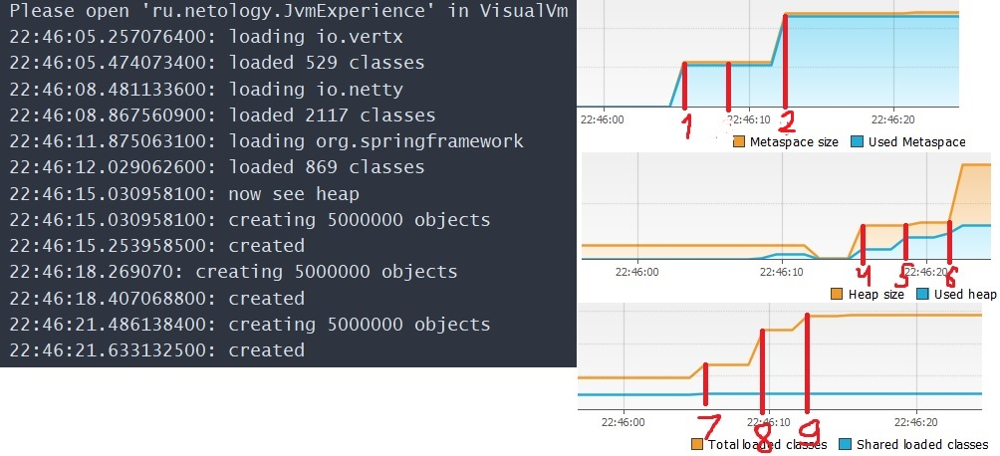

# Задания для практики понимания работы JVM

---

## Задача 1. Понимание JVM

```java
public class JvmComprehension {

    public static void main(String[] args) {
        int i = 1;                      // 1
        Object o = new Object();        // 2
        Integer ii = 2;                 // 3
        printAll(o, i, ii);             // 4
        System.out.println("finished"); // 7
    }

    private static void printAll(Object o, int i, Integer ii) {
        Integer uselessVar = 700;                   // 5
        System.out.println(o.toString() + i + ii);  // 6
    }
}
```

1. В стеке, внутри фрейма main выделяется память под хранение примитива i

2. ClassLoader'ы загружают класс Object, я так думаю, что Object, как базовый класс, загружается bootstrap classloader'ом в metaspace;
Затем в куче создается новый экземпляр Object и ссылка на него помещается в фрейм метода main в переменную o
3. Integer загружается classloader'ом в метаспейс, я так думаю, что опять же bootstrap'ом, так как это обёртка на базовым типом;
Затем аналогично в куче создается экземлпяр класса Integer и ссылка передается в ii в фрейме метода main
4. В стеке создается нвоый фрейм под метод printAll, внутри метода копируются ссылки на Object и Integer, создается переменная i, значение копируется
5. Создается экземпляр Integer в куче, ссылка на него передается в поле uselessVar в фреймe printAll в стеке
6. Создается нвоый фрейм println, в куче создается String со значением o.toString() + i + ii, ссылка на это значение передается в фрейм println
Не знаю, насколько это важно, но o.toString() также должно создавать дополнительный фрейм
Затем, так как выполнение метода println заканчивается удаляется фрейм println, gc чистит переданное в него значение, управление передается обратно в printAll
После работу завершает метод printAll, так как дальше операций нет, gc чистит uselessVar и удаляет ссылки на o, ii и чистит значение i, и передает упправление обратно в main
7. Создается новый фрейм println с переданным в него значением, не уверен, как это должно работать, но мне кажется. что создается нвоый экземпляр String,
ему задается значение "finished", после чего ссылка на этот экземпляр передается в фрейм.
После того, как метод завершает работу, gc чистит ранее созданное строковое значение и передает управление обратно в main
Так как операций далее нет, все зависимости удаляются и программа завершает работу.

---

## Задача 2. Исследование JVM через VisualVM



* Metaspace:

  1. На этом участке в Metaspace загружается мета информация о 529 классах, отрабатывает метод ```loadToMetaSpaceAllFrom("io.vertx")``` (далее работает аналогичный метод, но в метаспейсе нет никакого роста вплоть до 12 секунды)
  2. На этом участке работает метод ```loadToMetaSpaceAllFrom("org.springframework")```, по аналогии в метаспейс загружается информация о 869 классах

* Heap: на синей области на графике видно, что в данный момент, показатель "used heap" резко увеличился, так как в этот момент создалось 5000000 объектов класса SimpleObject, так происходит в пунктах 4 - 6, что соответствует вызовам ```createSimpleObjects()```

* Classes - пункты 7 - 9 соответствуют вызовам метода ```loadToMetaSpaceAllFrom()```, на графике это выглядит, как растущее количество подгруженных классов (loaded class)
